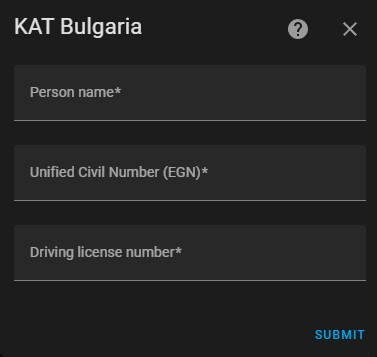

# KAT Bulgaria - a HACS integration for Home Assistant

The KAT Bulgaria custom integration allows users to check if they have any new fines from the Bulgarian Traffic Police (KAT).
The integration is a wrapper around the official government website.
([e-uslugi.mvr.bg](https://e-uslugi.mvr.bg/services/kat-obligations)).

## How it works

For each configured user this integration will create a single [binary_sensor](/integrations/binary_sensor) indicating if you have a fine or not. You can add as many entries as you need. Entries are updated once every 20 minutes.

In order to set up the integration, you need to provide a name, the person's EGN and the person's Driver License Number.

For every configured instance, a single entity is created in the format of `globi_{name}`.

Please note that the integration will not show any entities on its screen, you need to go in the entity list in order to find your entity.

## Standalone Python library

The integration uses my [py_kat_bulgaria](https://github.com/Nedevski/py_kat_bulgaria) library.

It's entirely separate from this integration and can be used on its own.
